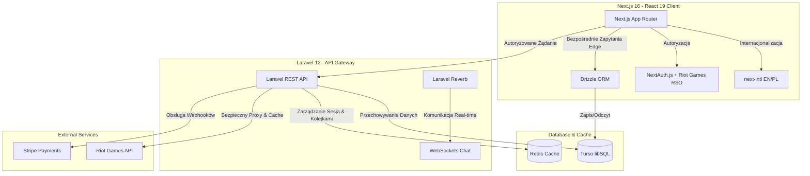

# 🎮 TFT-Coaching (Monorepo)

Platforma e-sportowa dedykowana dla społeczności Teamfight Tactics (TFT), łącząca trenerów z graczami w celu przeprowadzania lekcji na żywo, szczegółowych analiz wideo (VOD) oraz budowania konkurencyjnej społeczności. 

Projekt ten reprezentuje **komercyjną jakość inżynierii oprogramowania**, opierając się na architekturze Monorepo (Next.js + Laravel API) z zachowaniem rygorystycznych standardów czystego kodu, bezpieczeństwa i optymalizacji.

---

## 🏗️ Architektura Systemu

System składa się z niezależnego frontendu działającego w architekturze Serverless/Edge oraz kontenerowego backendu API obsługującego kluczowe procesy biznesowe.



---

## 🛠️ Stack Technologiczny i Rozwiązania

### 1. Frontend (`/frontend`) - Next.js 16 & React 19
- **Zarządzanie Stanem i Sesją:** **NextAuth.js** zintegrowany z **Riot Sign On (RSO)** (OAuth 2.0) oraz adaptacyjnym systemem lokalnych kont testowych (rola: Coach, Student, Admin).
- **Lokalizacja i i18n:** **next-intl** realizujący wielojęzyczność (PL/EN) na poziomie routingu dynamicznego (`/[locale]/...`) oraz statyczną weryfikację kompletności tłumaczeń.
- **Stylizacja i Design:** **Tailwind CSS v4** z wdrożonym systemem e-sportowej stylistyki (ciemny motyw, zaawansowane efekty glassmorphism, dynamiczne mikro-animacje, pełna zgodność kontrastu WCAG).
- **Komunikacja z Bazą Danych:** Bezpośredni odczyt/zapis z poziomu brzegu (Edge/Serverless) za pomocą **Drizzle ORM** połączonego z **Turso (libSQL)**.
- **SEO & Optymalizacja:** Dynamiczne tagi meta, generowanie dynamicznej sitemapy (`sitemap.xml`) oraz zgodność ze wskaźnikami Core Web Vitals (audyt Lighthouse).

### 2. Backend (`/backend`) - Laravel 12 & Docker (Sail)
- **Komunikacja w czasie rzeczywistym:** **Laravel Reverb** — wbudowany, wysokowydajny serwer WebSockets zintegrowany z driverem Redis w celu natychmiastowej komunikacji na czacie.
- **Bezpieczeństwo Riot Games API:** Backend działa jako **Proxy Gateway** dla oficjalnego API Riot Games. Zapytania są cache'owane w **Redis**, co zapobiega przekroczeniu limitów (Rate Limits) i całkowicie ukrywa klucze API przed klientem.
- **Płatności:** Integracja ze **Stripe Checkout** wraz z obsługą asynchronicznych powiadomień (Webhooks) do natychmiastowego opłacania rezerwacji.
- **Konteneryzacja:** Pełne lokalne środowisko uruchomieniowe oparte o **Docker Compose** i **Laravel Sail** (PHP 8.4, Redis, MySQL).

---

## 🛡️ Dobre Praktyki Inżynierskie (DX & Quality Assurance)

Jakość kodu i bezpieczeństwo są automatycznie weryfikowane przed każdym wdrożeniem produkcyjnym:

- **Strict TypeScript:** Wyłączony typ `any` (`@typescript-eslint/no-explicit-any`), silne typowanie propsów, odpowiedzi z API oraz walidacja formularzy za pomocą biblioteki **Zod**.
- **Wydajne Lintowanie:** Zastosowanie **Ultracite** jako szybkiej nakładki lintera (wykorzystującej m.in. **Oxlint** w technologii Rust) oraz **Prettier** i **Stylelint** do spójnego formatowania.
- **Analiza zależności (Knip):** Narzędzie **Knip** kontroluje i eliminuje nieużywany kod, martwe eksporty oraz zbędne pakiety `npm`.
- **Walidacja i18n:** Narzędzie **i18n-check** zapewnia spójność struktury tłumaczeń języka polskiego i angielskiego.
- **CI/CD:** Skonfigurowane potoki GitHub Actions wdrożenia produkcyjnego (zero-downtime deploy backendu na serwer VPS Intel).
- **Zgodność z ToS:** Architektura zaprojektowana tak, aby przestrzegać regulaminu Riot Games (brak usług typu boosting, wyłącznie ustrukturyzowany coaching).

---

## 🚀 Szybki Start (Uruchomienie Lokalne)

### 1. Wymagania wstępne
Upewnij się, że masz zainstalowane:
- **Node.js 20+** oraz npm.
- **Docker Desktop** (do uruchomienia backendu).

### 2. Uruchomienie Backend API
```bash
cd backend
# Uruchom kontenery Docker w tle (Sail)
docker compose up -d

# Włącz serwer WebSockets Reverb
docker exec -d backend-laravel.test-1 php artisan reverb:start
```
Backend będzie dostępny pod adresem `http://localhost`, a WebSockets na porcie `8080`.

### 3. Uruchomienie Frontend Client
```bash
cd frontend
# Instalacja zależności
npm install

# Uruchomienie serwera deweloperskiego Next.js
npm run dev
```
Aplikacja będzie dostępna pod adresem `http://localhost:3000`.

### 4. Skrypty sprawdzające (Frontend Quality Assurance)
Przed zatwierdzeniem kodu zawsze uruchamiamy następujący zestaw poleceń:
```bash
npm run check:types  # Weryfikacja typów TypeScript (tsc)
npm run check:i18n   # Sprawdzenie słowników językowych (i18n-check)
npm run check:deps   # Wykrywanie martwego kodu i nieużywanych zależności (knip)
npm run lint:fix     # Automatyczne formatowanie i naprawa błędów lintera
npm run build        # Kompilacja produkcyjna Next.js
```
